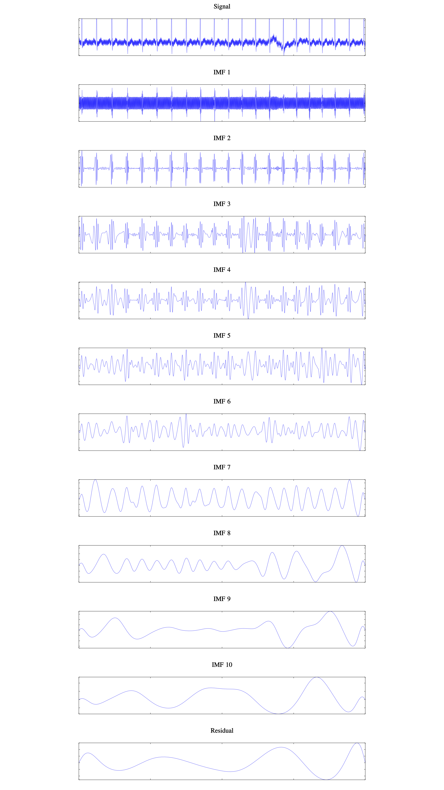
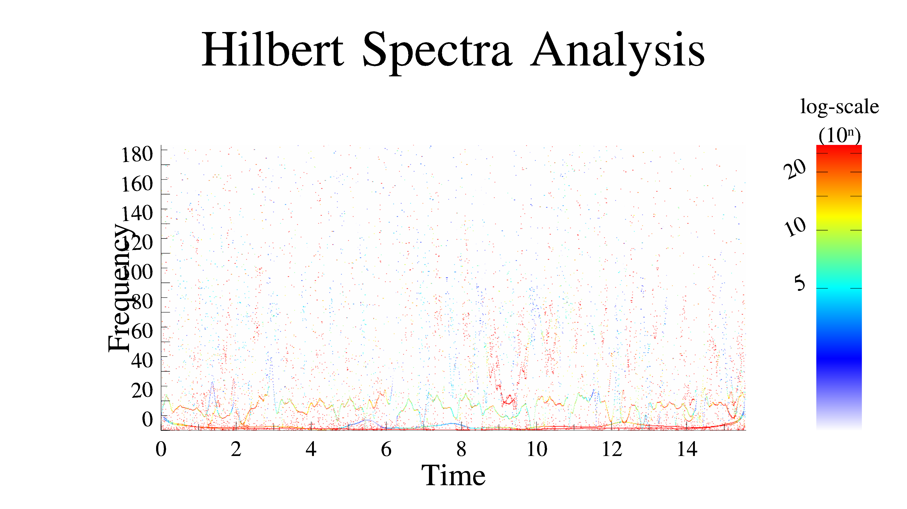
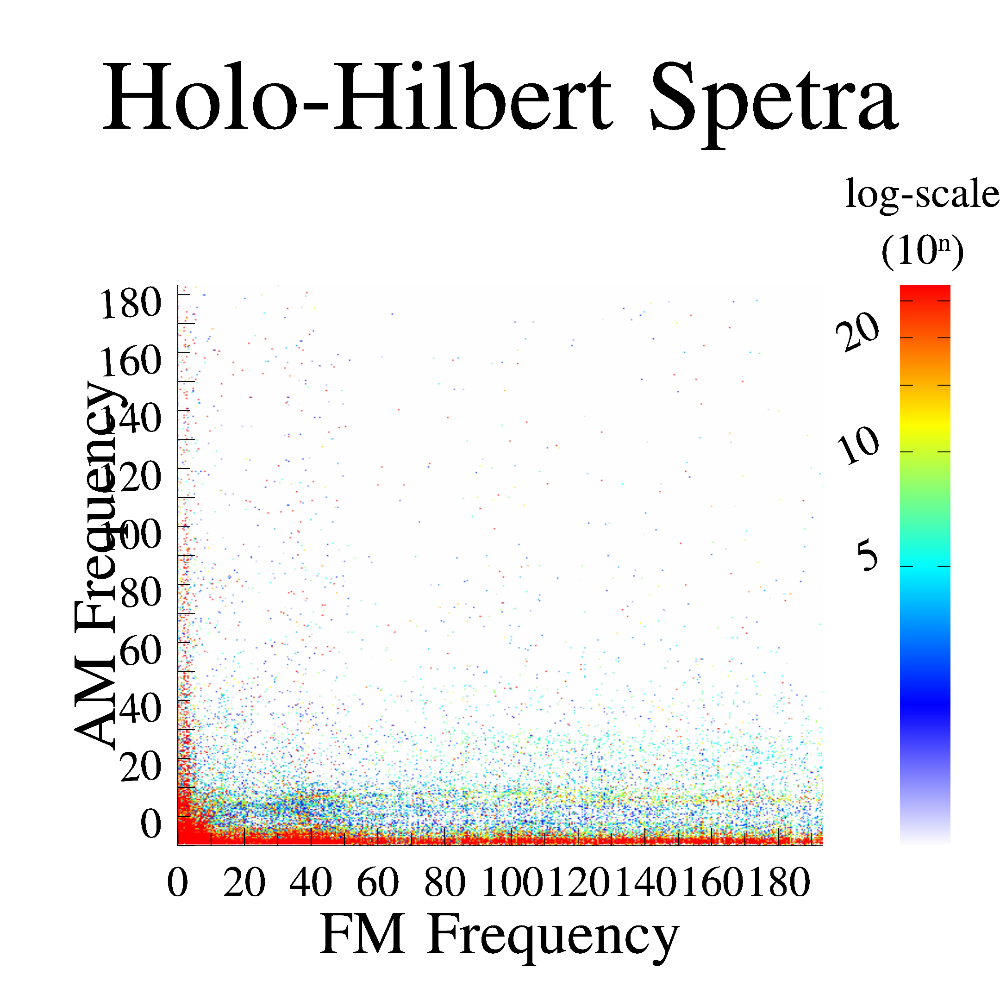
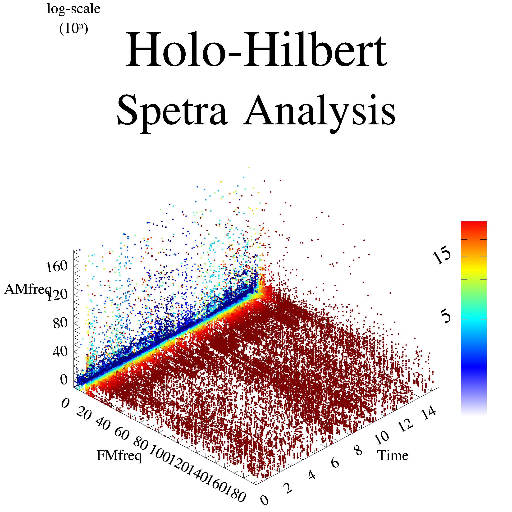

# Holo-Hilbert Spectral Analysis (HHSA)
## OpenMP Version
### Introduction
- This program contain Hilbert–Huang Transform (HHT) and Holo-Hilbert Spectral Analysis (HHSA)

- We will doing HHT with Complete Ensemble Empirical Mode Decomposition (CEEMD) or Ensemble Empirical Mode Decomposition (EEMD) to get several Intrinsic Mode Function (IMF)

- And then use the result of IMF to do HHSA (Calculate (CEEMD or EEMD) with Upper Envelope (UpEnvelope in Code) of IMF as Input since we are focus on the ECG peak, you can change it to LowEnvelope by modify the code)

- The parallel computing by OpenMP is doing on EEMD. We recommended that Ensemble Number in HHSA_profile.txt should equal to the multiples of CPU Threads Count.

- In this code, we use "normal_distribution" random number generator to generate the Noise that add per EEMD iteration. You can change it to "uniform_real_distribution" by modify the code.

- Original HHSA Paper here: https://royalsocietypublishing.org/doi/10.1098/rsta.2015.0206

- And Instantaneous Frequency Paper here: https://www.worldscientific.com/doi/10.1142/S1793536909000096

#### Hilbert-Huang Transform (HHT)

#### Hilbert Spectra Analysis (HSA)

#### Holo-Hilbert Spectra (HHS)

#### Holo-Hilbert Spectra Analysis (HHSA)

### Hardware Requirement
- At leaset 5GB Free Memory to run our small sample. (HeartRate.txt)

### Compiling
- Unzip Library: mathgl-8.0.3-MSVC to D:\Compile\mathgl-8.0.3-MSVC

- open HHSA_CPU_OpenMP.sln with Visual Studio 2022 and Choose Release x64 then Build

### Execution
- Move files in Profile Folder to x64\Release Folder

- copy dll from C:\mathgl-8.0.3-MSVC\bin to x64\Release or add C:\mathgl-8.0.3-MSVC\bin into environment $PATH

- modify parameter in HHSA_profile.txt, modify input file in Run_HHSA.bat

- Execute Run_HHSA.bat

### Explanation
- (INPUT)_HHT.csv	contain the result of HHT

  + IMF: Intrinsic Mode Function

  + Residual: The residual value after each mode decomposition

  + Up: UpperEnvelope

  + Low: LowerEnvelope

  + Mean: MeanEnvelope

  + FM: Frequency Modulation

  + AM: Amplitude Modulation

  + IP: Instantaneous Phase

  + IF: Instantaneous Frequency

- (INPUT)_HSA.png is the Hilbert Spectra Analysis that plot the Instantaneous Frequency across time

- (INPUT)_HHSA_mode(NUM).csv contain the result of HHSA on each mode of the HHT on IMF Upper Envelope

- (INPUT)_HHS.png is the Holo-Hilbert Spectra that plot the AM Frequency and FM Frequency by HHSA result (Sum of all time)

- (INPUT)_HHSA_3D.png is the Holo-Hilbert Spectra Analysis result which is a short time HHS according to TimeCell Duration along Time

- (INPUT)_HHSA.gif is the Holo-Hilbert Spectra Analysis result which is a short time HHS according to TimeCellGroup as step along Time

### Linux
- Debian/Ubuntu: "apt-get install libmgl-dev g++ make"

- CentOS: "yum install mathgl-devel gcc-c++ make" (I don't really test it, jsut copy paste)

- cd to HHSA_CPU_OpenMP folder which contain Makefile: "make"

- "./HHSA_CPU_OpenMP HeartRate.txt"

### Notice
- This code is done in my spare time. Not verified by third party.
